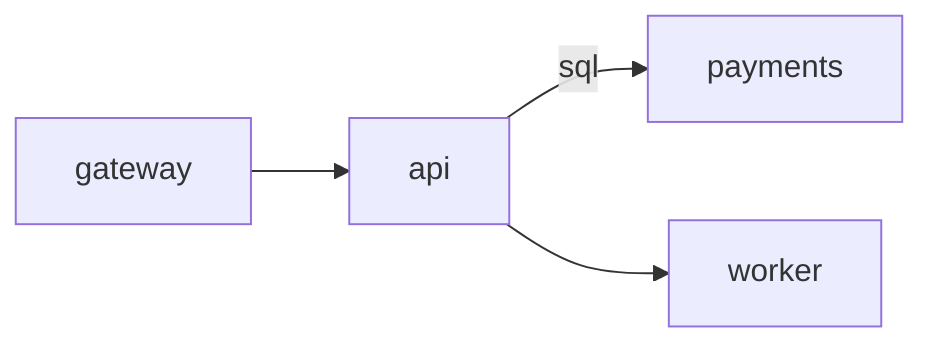

# Payments architecture

The API serves the public gateway and stores data in Postgres. See
[the build script](../scripts/build.sh) and `scripts/deploy.sh`.

## Context diagram

```mermaid
flowchart LR
    gateway --> api
    api -->|sql| payments
    api --> worker
```

